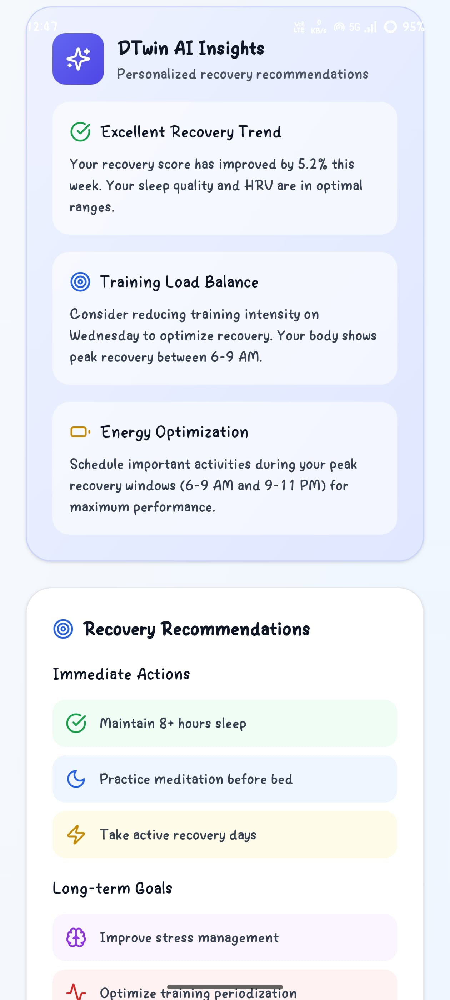

# 🧠 Dtwin – All-in-One Health Management & Disease Prediction App

Dtwin is an AI-powered, full-stack health management application designed to deliver **personalized real-time health insights**, **early disease predictions**, and **custom meal and fitness recommendations**. Leveraging data from wearables like Fitbit and other real-time sources, Dtwin empowers users to take control of their health with AI-driven guidance—not generic advice.

---

## 🚀 Live Demo

🔗 **Live Web App**: [https://dtwin-health.app](https://dtwin-health.app)  
🔗 **Backend API**: [https://api.dtwin-health.app](https://api.dtwin-health.app)

> 💡 Also available as a cross-platform mobile app via Capacitor (Android/iOS).

---

## 📸 App Screenshots


| 🫀 Heart Analytics | 🤖 AI Insights | 🩺 Disease Prediction |   |
|:---------------:|:----------------:|:----------------------:|:-:|
|  |  |  |

| 📊 Recovery Dashboard | 🔎 Gut Analysis | 📈 Health Overview |   |
|:---------------:|:----------------:|:----------------------:|:-:|
|  |  |  |   |

---

## 🧬 Features

- 🩺 **Disease Prediction**  
  Real-time risk prediction for:
  - Heart Disease
  - Diabetes
  - Gut Health Disorders
  - More conditions coming soon

- 📊 **Real-Time Health Insights**  
  Get instant health feedback based on:
  - Fitbit data
  - Heart rate variability
  - Step count, sleep patterns, calorie burn

- 🍽️ **Personalized Meal Plans**  
  Custom diet suggestions tailored to each user's:
  - Blood sugar trends
  - Activity level
  - Gut microbiome profiles

- 🏃‍♂️ **Custom Exercise Recommendations**  
  Dynamic fitness plans based on:
  - Energy expenditure
  - Weight trends
  - Recovery and fatigue scores

- 📈 **Smart Analytics Dashboard**  
  Visualizations and predictions to help you make smarter decisions about your health.

---

## 🛠️ Tech Stack

### 🔷 Frontend
- React.js
- TailwindCSS
- Chart.js & D3.js (for visualizations)

### 🔶 Backend
- Node.js
- Express.js
- REST API (with token-based authentication)
- MongoDB (for user data)

### 🧪 Machine Learning
- Python (Scikit-learn, TensorFlow)
- Trained on real-time + public datasets
- Served via FastAPI/Python microservices

### 📱 Mobile App
- Capacitor.js
- Android & iOS builds

---

## 📂 Datasets Used

- **Heart Disease Prediction**: Garmin Real-Time Sensor Dataset  
- **Diabetes Prediction**: IICMBC Clinical Dataset  
- **Gut Health**: American Gut Project (AGP)

All models are trained with preprocessing pipelines and continuously updated using anonymized wearable data.

---

## ⚙️ Installation (Development)

### Prerequisites
- Node.js & npm
- Python 3.9+
- MongoDB running locally or Atlas DB

### Clone and Run

```bash
git clone https://github.com/yourusername/dtwin.git
cd dtwin

# Install frontend
cd client
npm install
npm start

# Install backend
cd ../server
npm install
npm run dev

# Run ML services
cd ../ml-service
pip install -r requirements.txt
uvicorn app:main --reload
